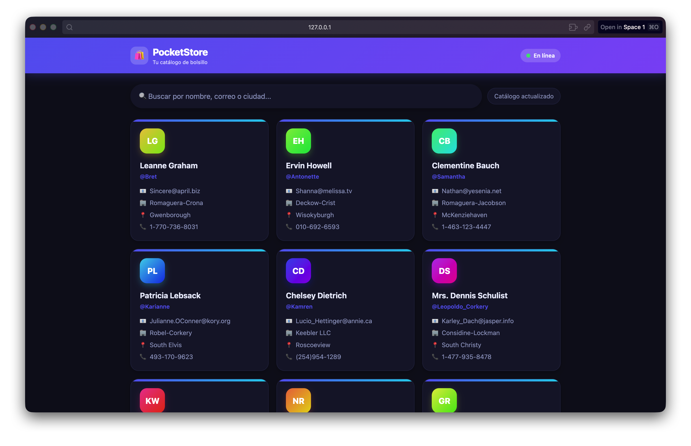
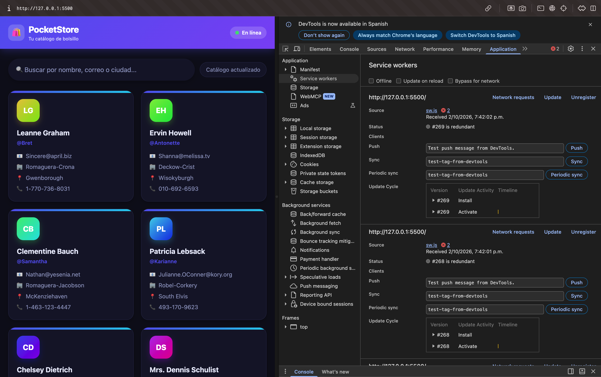
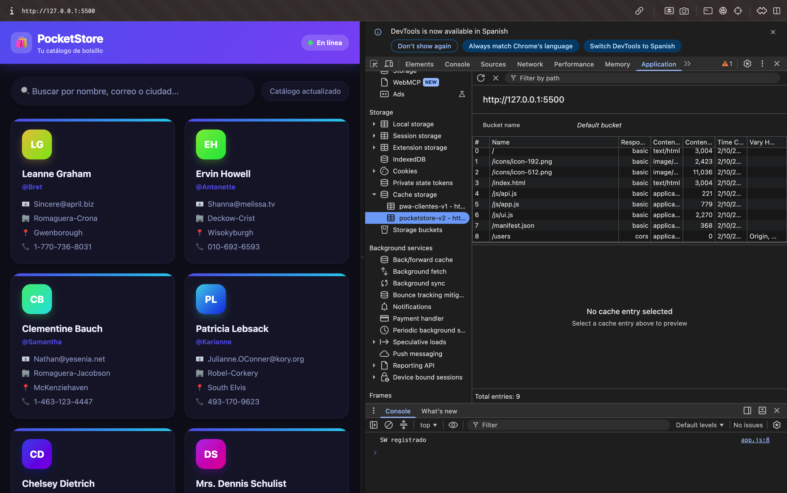
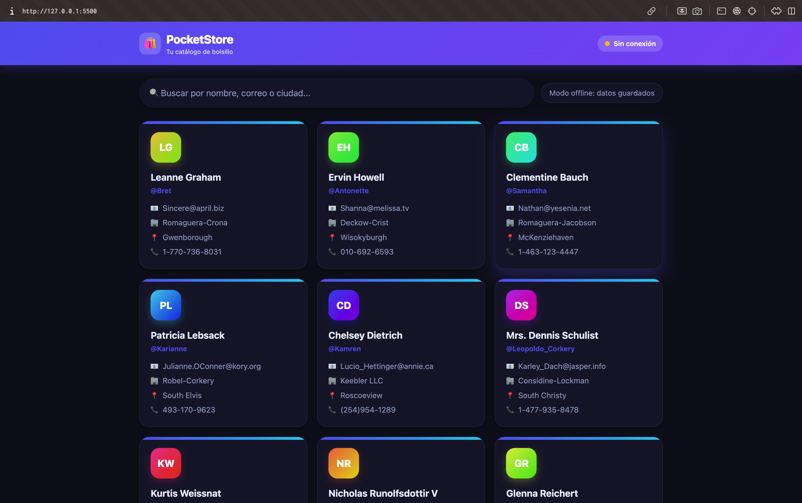

# 🛍️ PocketStore

Catálogo web de una sola página que **funciona completamente sin internet**. Está hecho con Vanilla JS, un Service Worker y un Web App Manifest, siguiendo la arquitectura **App Shell**.

- **Modalidad:** desarrollo individual
- **Autor:** _Tu nombre aquí_
- **Materia / Grupo:** _Materia y grupo aquí_

---

## 📌 Descripción

PocketStore muestra un catálogo de usuarios obtenido de la API pública [JSONPlaceholder](https://jsonplaceholder.typicode.com/users). La interfaz (App Shell) se guarda en la caché del navegador, así que carga al instante y sigue funcionando sin conexión. Los datos de la API también se guardan, por lo que el catálogo se puede consultar offline después de la primera visita.

## 🧰 Tecnologías

- HTML5 y CSS3 (diseño responsivo, modo oscuro automático)
- JavaScript (Vanilla, módulos ES)
- Service Worker + Cache API
- Web App Manifest (PWA instalable)
- API pública: JSONPlaceholder

## 📁 Estructura del proyecto

```
pocket-store/
├── index.html         # Vista (App Shell)
├── styles.css         # Estilos del App Shell
├── manifest.json      # Configuración de instalación
├── sw.js              # Service Worker y caché
├── README.md          # Documentación
├── icons/             # Íconos 192x192 y 512x512
├── screenshots/       # Capturas del proceso de desarrollo
└── js/
    ├── app.js         # Lógica principal y registro del SW
    ├── api.js         # Consumo de la API con fetch()
    └── ui.js          # Renderizado de la interfaz
```

## ▶️ Cómo ejecutarlo

Los Service Workers solo funcionan en `localhost` o HTTPS (no con `file://`).

1. Clona o descarga el proyecto.
2. Ábrelo con **Live Server** en VS Code (clic derecho en `index.html` → *Open with Live Server*).
   - Alternativa: `npx serve` dentro de la carpeta del proyecto.
3. Abre la dirección que te indique (por ejemplo `http://127.0.0.1:5500`) en Chrome.

---

## 🛠️ Proceso de desarrollo

### 1. El Manifiesto (`manifest.json`)

Se creó a mano el archivo con `name`, `short_name`, `start_url`, `display: "standalone"`, los colores de la app y dos íconos (192x192 y 512x512). Esto permite que el navegador ofrezca instalar la app como si fuera nativa.


> Se verifica en **DevTools → Application → Manifest**.

### 2. El App Shell (`index.html` y `styles.css`)

Se diseñó la estructura estática: barra superior con el título y un indicador de conexión, un contenedor principal con buscador y rejilla de tarjetas, y un pie de página. Mientras llegan los datos se muestran _skeletons_ (tarjetas de carga), de modo que la vista aparece al instante.



### 3. El Service Worker y la Caché (`sw.js`)

Se programó el ciclo de vida completo:

| Evento | Qué hace |
|---|---|
| `install` | Guarda en caché todos los archivos del App Shell. |
| `activate` | Elimina las cachés de versiones anteriores. |
| `fetch` | **App Shell:** primero caché, luego red. **API:** primero red y, si falla, usa la copia guardada. |





### 4. El Contenido Dinámico (`js/app.js`, `js/api.js`, `js/ui.js`)

`api.js` consume JSONPlaceholder con `fetch()`, `ui.js` pinta las tarjetas y el buscador, y `app.js` registra el Service Worker y coordina todo. Cada tarjeta muestra nombre, usuario, correo, empresa, ciudad y teléfono.


### 5. Pruebas en modo offline

Con la pestaña **Network → Offline** activada y recargando la página, la aplicación y los datos siguen apareciendo. El indicador del encabezado cambia a **"Sin conexión"**.



---

## 🧪 Cómo probar el modo offline

1. Abre la app con Live Server y espera a que cargue (esto llena la caché).
2. Abre DevTools (`F12`) → **Application → Service Workers** y comprueba que el estado sea _activated and is running_.
3. Recarga la página una vez más.
4. En **Network** marca la casilla **Offline** y recarga (`Ctrl+R`).
5. La app debe cargar completa, con estilos y datos.

## ⚠️ Problemas encontrados y soluciones

- **Los estilos nuevos no se veían después de editar los archivos.** El Service Worker seguía entregando la versión vieja desde la caché. Solución: cambiar la versión de `CACHE_NAME` (por ejemplo `pocketstore-v2`), o usar **Unregister** y **Clear site data** en DevTools.
- **El Service Worker no se registraba.** Ocurría al abrir `index.html` directamente con `file://`. Solución: servir el proyecto con Live Server (`localhost`).

## 📚 Referencias

- [MDN – Service Worker API](https://developer.mozilla.org/es/docs/Web/API/Service_Worker_API)
- [MDN – Web App Manifest](https://developer.mozilla.org/es/docs/Web/Manifest)
- [JSONPlaceholder](https://jsonplaceholder.typicode.com/)